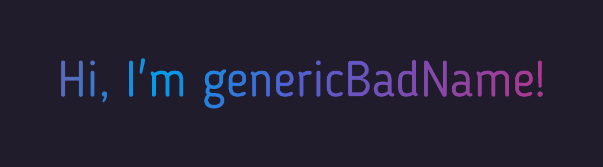

Hello there! :wave:

I'm a hobbyist developer in high school with a long-standing passion for programming and game design. I work on projects because they're fun and a great way to learn new skills!

## 📌Active Projects

Sorry to disappoint, nothing at the moment.

## 📈 Some Stats

## 💻 Languages / Frameworks

## 💼 Other Proficiences

### 📞 Contact Information

